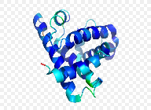

#  Multimodal dataset of protein-protein interactions <br/> for the classification of extremely multi-functional proteins: <br/> dataset, benchmarks and tools


## Goal of the GitLab

This GitLab project contains 
* the MuPPI multiview dataset, 
* the instructions and material to reproduce it, 
* and a benchmark machine learning analysis.

Source code (scripts and dockerfiles) are available. Required data and built 
Docker images are available to download. Instructions to reproduce the analysis 
are provided below.

To reproduce the dataset, you have to first, 
[prepare the environments](#prepare-the-environments), 
then [build the dataset](#how-the-dataset-was-built) step by step.

---
---

## Data files description

### View data

The data is provided in a zip file denoted `./datasets/data.zip`, in which all the dataset is compressed. 
Once you pulled the repository and decompressed the zip file, you can access all the raw data.

In the `./datasets/data` folder you will find subdirectories `/*_view`, in which the data of 
each view is stored. Its description and sources can be found in 
[the documentation](https://dev.pages.lis-lab.fr/muppi-dataset-neurips/dataset.html). 
Some files have multiple versions :
- \_NoNA : 				Data without examples that include NA values
- \_numerised : 	Data where strings are replaced by integers
- \_light : 			Data with only the most informative features (see more 
in ["Light version"](#light-version) section below)

Here are the different raw data files available :

    MuPPI
    └── datasets
        └── data
	        ├── 3UTR_Complexes_view
	        │   ├── 3UTR_Complexes_NoNA.txt
	        │   └── 3UTR_Complexes.txt
	        ├── Gene_Ontology_view
	        │   ├── Gene_Ontology_BP_light.txt
	        │   ├── Gene_Ontology_BP.txt
	        │   ├── Gene_Ontology_CC_light.txt
	        │   ├── Gene_Ontology_CC.txt
	        │   ├── Gene_Ontology_MF_light.txt
	        │   └── Gene_Ontology_MF.txt
	        ├── GO_PPInetwork_view
	        │   ├── GO-BP_PPInetwork_embed.txt
	        │   ├── GO-BP_PPInetwork.txt
	        │   ├── GO-CC_PPInetwork_embed.txt
	        │   └── GO-CC_PPInetwork.txt
	        ├── Linear_Motifs_view
	        │   └── Linear_Motifs_SlimProb.txt
	        ├── Phenotype_Ontology_view
	        │   ├── Phenotype_Ontology_light.txt
	        │   └── Phenotype_Ontology.txt
	        ├── Post_Traductionnal_Modifications_view
	        │   └── Post_Traductionnal_Modifications.txt
	        ├── PPInetwork_Embedding_view
	        │   └── SDNE_PPInetwork.txt
	        ├── PPInetwork_topology_view
	        │   └── PPInetwork_topology.txt
	        ├── Protein_Domains_view
	        │   ├── Protein_Domains_light.txt
	        │   └── Protein_Domains.txt
	        ├── Subcell_Location_view
	        │   ├── Subcell_Location_numerised.txt
	        │   └── Subcell_Location.txt
	        └── Tissue_Expression_view
	            ├── Tissue_Expression_NoNA.txt
	            └── Tissue_Expression.txt


### HDF5 files

In `./datasets/data/dataset_compilation_to_hdf5`, you will find the HDF5 data files. 
These files contain the data of all views and the labels. We made an intersection
 of available views, so only the samples described by all the views are in these files. 
 Multiple HDF5 file versions are available :

- \_light :	Contains the views that can be used in the light version (see more [below](#light-version))
- \_oversampled :	Contains for all views augmented data in the EMF class 
(enough to reach a 1/2 ratio for EMF/multi_clustered)(see more [below](#oversampling))


They are generated by the [`hdf5_transfo`](./script/dataset_compilation_to_hdf5/hdf5_transfo.py) script, and are organized as follows :

* One dataset for each view called `Viewi` with `i` being the view index with 2 attributes : 
    * `attrs["name"]` a string for the name of the view
    * `attrs["sparse"]` a boolean specifying whether the view is sparse or not (WIP)
 

* One dataset for the labels called `Labels` with one attribute : 
    * `attrs["names"]` a list of strings encoded in utf-8 naming the labels in the right order

* One group for the additional data called `Metadata` containing at least 1 dataset :
    * `"example_ids"`, a numpy array of type `S100`, with the ids of the examples in the right order
* And three attributes : 
    * `attrs["nbView"]` an int counting the total number of views in the dataset
    * `attrs["nbClass"]` an int counting the total number of different labels in the dataset
    * `attrs["datasetLength"]` an int counting the total number of examples in the dataset


## Prepare the environments

In order to prepare the environment for dataset build, it is required to
- clone the github repository,
- enter the directory where you clone it, and run the following code

```
pip install -e .
cd script/rawData/
sh DownloadRawData.sh
```


## How the dataset was built

From the data files in `rawData` and the scripts in the 
`./script/\*\_view subfolders`, you can reconstruct the dataset. 
Be careful, the data recovered in several views come from other databases 
(see [the documentation](https://dev.pages.lis-lab.fr/muppi_neurips/)
which are regularly updated. It is therefore likely that when recreating the dataset, 
it is not exactly identical to the one delivered here.

Each view can be created separately with the script 
`./script/X_view/Build_X_dataset.sh`. You can also start the generation of all 
views with the script [`Build_all_dataset.sh`](./script/Build_all_dataset.sh). 
The `.txt` files of each view will then be generated in their respective `./data/\*\_view` subdirectories.

**Warning** : The "PPInetwork Embedding" and "GO PPInetwork Embedding" views 
are generated with the [OpenNE](https://github.com/thunlp/OpenNE) toolkit. 
However the dependencies of this package are incompatible with those of this 
GitLab repository. So to generate the Embeddings views, you need to install 
this package in a separate environment, then run the scripts 
`./script/X_embedding_view/Build_X_embedding_dataset.sh` in this environment.

### Create HDF5 file

To then create an hdf5 file gathering all these views, just launch the 
[`hdf5_transfo`](./script/dataset_compilation_to_hdf5/hdf5_transfo.py) script 
and enter the desired parameters in input :

- full version (y/n) : In full version the complete views will be entered, 
with the missing data. Otherwise, only the examples present in all the views will be entered.
- light version (y/n) : Introduce the views that can be used in the 
light version (see more in [Light version](#light-version)).
- which labels (EMF/complexes) : To choose your labels. "complexes" is for 
`3UTR_Complexes` labels, which is an optional task to predict if a protein is a 
"nascent" in some 3UTR complexes (see 
[3UTR Complexes](https://dev.pages.lis-lab.fr/muppi-dataset-neurips/dataset.html#utr-complexes-view) 
in the documentation)

It will be created in the directory `./data/dataset_compilation_to_hdf5/`.


### Light version

Some views are very sparse matrices of large dimensions. To limit the size of 
these views we have used the [CutSmallLeafs](./script/Functions/functions.py#L125) 
function that generates them.

It removes features that are not very informative, i.e. that contain less than 
X non-zero values. X being by default 6, it can be modified by the argument 
`leaf_max_size`. With a `leaf_max_size = 6`, the number of features of these 
views is on average divided by two, and the EMF prediction task is not impacted,
 according to our preliminary study.


### Oversampling

The classes in the dataset are very unbalanced, and under-representation of the 
EMF class can lead to biases. To remedy this, one solution is to augment the 
data to balance the dataset. This is what we tried to do with the 
[oversampling](./script/Functions/oversampling.py) script, which uses the SMOTE 
algorithm [[1]](#ref_1) of the imbalanced-learn module [[2]](#ref_2) .

This script takes as input an hdf5 file generated by 
[`hdf5_transfo`](./script/dataset_compilation_to_hdf5/hdf5_transfo.py), and the 
factors by which will multiply the cardinality of each class. For example: 
"1,2,10" does not change the number of mono\_clustered, doubles the number of 
multi\_clustered, and multiplies the number of EMFs by 10. A new hdf5 file of 
the oversampled dataset is created as output. The artificial data is named in 
`dataset["Metadata"]["example_ids"]` as `"new_example_(number)"`.

---
---

## References

<a name="ref_1"></a>
[1]: Chawla N.V., Bowyer K.W., Hall L.O., Kegelmeyer W.P. SMOTE: Synthetic minority over-sampling technique. J. Artif. Intell. Res. 2002;16:321–357. doi: 10.1613/jair.953.

<a name="ref_2"></a>
[2] : [imbalanced-learn](https://github.com/scikit-learn-contrib/imbalanced-learn)

    @article{JMLR:v18:16-365,
     author  = {Guillaume  Lema{{\^i}}tre and Fernando Nogueira and Christos K. Aridas},
     title   = {Imbalanced-learn: A Python Toolbox to Tackle the Curse of Imbalanced Datasets in Machine Learning},
     journal = {Journal of Machine Learning Research},
     year    = {2017},
     volume  = {18},
     number  = {17},
     pages   = {1-5},
     url     = {http://jmlr.org/papers/v18/16-365.html}
    }

## Licence

**New BSD License**
**BSD-3-Clause**

## Copyright
<!--
Université d'Aix Marseille (AMU) -
Centre National de la Recherche Scientifique (CNRS) -
Université de Toulon (UTLN).

Copyright © 2019-2025 AMU, CNRS, UTLN
-->
## Authors
<!--
* **Kossi KOSSIVI**
* **Alexis PROD'HOMME**
* **Dominique BENIELLI**
* **Baptiste BAUVIN**
-->
